---
## Front matter
title: "Отчёт по лабораторной работе №2"
subtitle: "Дисциплина: архитектура компьютера"
author: "Кайнова Алина Андреевна"

## Generic otions
lang: ru-RU
toc-title: "Содержание"

## Bibliography
bibliography: bib/cite.bib
csl: pandoc/csl/gost-r-7-0-5-2008-numeric.csl

## Pdf output format
toc: true # Table of contents
toc-depth: 2
lof: true # List of figures
lot: true # List of tables
fontsize: 12pt
linestretch: 1.5
papersize: a4
documentclass: scrreprt
## I18n polyglossia
polyglossia-lang:
  name: russian
  options:
	- spelling=modern
	- babelshorthands=true
polyglossia-otherlangs:
  name: english
## I18n babel
babel-lang: russian
babel-otherlangs: english
## Fonts
mainfont: PT Serif
romanfont: PT Serif
sansfont: PT Sans
monofont: PT Mono
mainfontoptions: Ligatures=TeX
romanfontoptions: Ligatures=TeX
sansfontoptions: Ligatures=TeX,Scale=MatchLowercase
monofontoptions: Scale=MatchLowercase,Scale=0.9
## Biblatex
biblatex: true
biblio-style: "gost-numeric"
biblatexoptions:
  - parentracker=true
  - backend=biber
  - hyperref=auto
  - language=auto
  - autolang=other*
  - citestyle=gost-numeric
## Pandoc-crossref LaTeX customization
figureTitle: "Рис."
tableTitle: "Таблица"
listingTitle: "Листинг"
lofTitle: "Список иллюстраций"
lotTitle: "Список таблиц"
lolTitle: "Листинги"
## Misc options
indent: true
header-includes:
  - \usepackage{indentfirst}
  - \usepackage{float} # keep figures where there are in the text
  - \floatplacement{figure}{H} # keep figures where there are in the text
---

1. # Цель работы

Изучить идеологию систем контроля версий и научиться применять их, в частности, приобрести навыки по работе с Git.

2. # Задание

1. Настройка Github
2. Базовая настройка Git
3. Создание SSH ключа
4. Создание рабочего пространства и репозитория курса на основе шаблона
5. Создание репозитрия курса на основе шаблона
6. Настройка каталога курса 
7. Задания для самостоятельной работы

3. # Теоретическое введение

Системы контроля версий (Version Control System, VCS) применяются при
работе нескольких человек над одним проектом. Обычно основное дерево проекта
хранится в локальном или удалённом репозитории, к которому настроен доступ для
участников проекта. При внесении изменений в содержание проекта система
контроля версий позволяет их фиксировать, совмещать изменения, произведённые
разными участниками проекта, производить откат к любой более ранней версии
проекта, если это необходимо.
В классических системах контроля версий используется централизованная
модель, пред- полагающая наличие единого репозитория для хранения файлов.
Выполнение большинства функций по управлению версиями осуществляется
специальным сервером. Участник проекта перед началом работы посредством
определённых команд получает нужную ему версию файлов. После внесения
изменений, пользователь размещает новую версию в хранилище. При этом
предыдущие версии не удаляются из центрального хранилища и к ним можно
вернуться в любой момент. Сервер может сохранять не полную версию изменённых
файлов, а производить так называемую дельта-компрессию — сохранять только
изменения между последовательными версиями, что позволяет уменьшить объём
хранимых данных.
Системы контроля версий поддерживают возможность отслеживания и
разрешения конфликтов, которые могут возникнуть при работе нескольких человек
над одним файлом. Можно объединить (слить) изменения, сделанные разными
участниками (автоматически или вручную), вручную выбрать нужную версию,
отменить изменения вовсе или заблоки-ровать файлы для изменения. В
зависимости от настроек блокировка не позволяет другим пользователям получить
рабочую копию или препятствует изменению рабочей копии файла средствами
файловой системы ОС, обеспечивая таким образом, привилегированный доступ
только одному пользователю, работающему с файлом.
Системы контроля версий также могут обеспечивать дополнительные, более
гибкие функциональные возможности. Например, они могут поддерживать работу с
несколькими версиями одного файла, сохраняя общую историю изменений до точки
ветвления версий и собственные истории изменений каждой ветви. Кроме того,
обычно доступна информация о том, кто из участников, когда и какие изменения
вносил. Обычно такого рода информация хранится в журнале изменений, доступ к
которому можно ограничить. В отличие от классических, в распределённых системах
контроля версий центральный репозиторий не является обязательным.

4. # Выполнение лабораторной работы

## Настройка Github

- Создадим учётную запись на сайте GitHub
{#fig:001 width=70%}

## Базовая настройка Git

- Сделаем предварительную конфигурацию Git
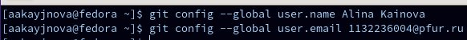{#fig:002 width=70%}

- Настроим utf-8
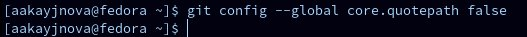{#fig:003 width=70%}

- Зададим имя начальной ветви
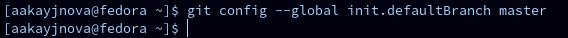{#fig:004 width=70%}

- Зададим параметр autocrlf
{#fig:005 width=70%}

- Зададим параметр safecrlf
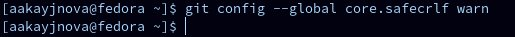{#fig:006 width=70%}

## Создание SSH ключа

- Генерируем пару ключей
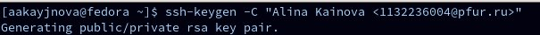{#fig:007 width=70%}

- Копируем ключ из локальной консоли
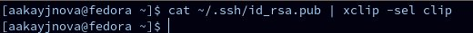{#fig:008 width=70%}

- Добавляем новый ключ
{#fig:009 width=70%}

## Создание рабочего пространства и репозитория курса на основе шаблона

- Создадим каталог для данного предмета через терминал и проверим правильность выполнения команды
{#fig:0010 width=70%}

## Создание репозитория курса на основе шаблона

- В браузере переходим на страницу репозитория с шаблоном курса
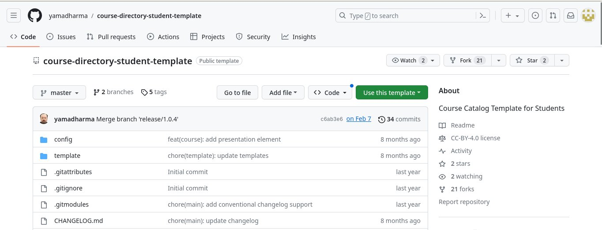{#fig:0011 width=70%}

- Зададим имя репозитория и создадим его
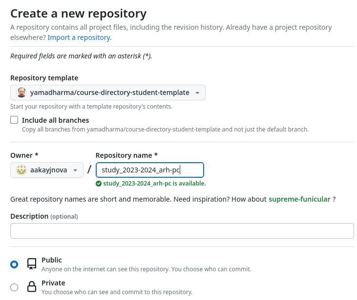{#fig:0012 width=70%}

- Репозиторий создан
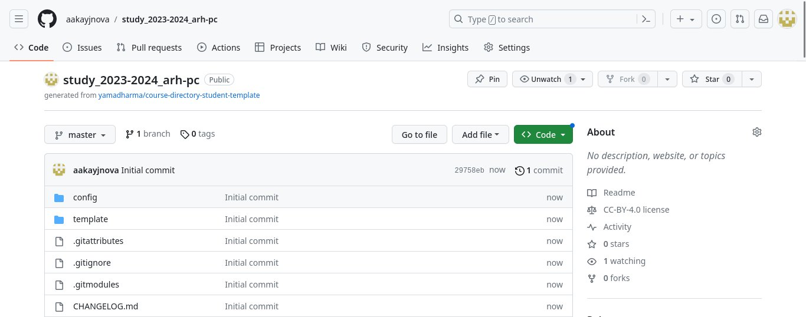{#fig:0013 width=70%}

- Переходим в созданный каталог курса через терминал
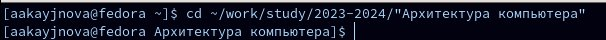{#fig:0014 width=70%}

- Копируем ссылку репозитория
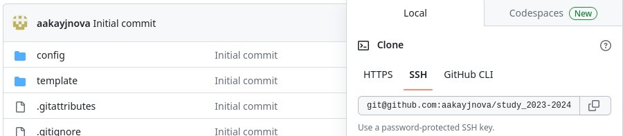{#fig:0015 width=70%}

- Клонируем репозиторий, используя ссылку
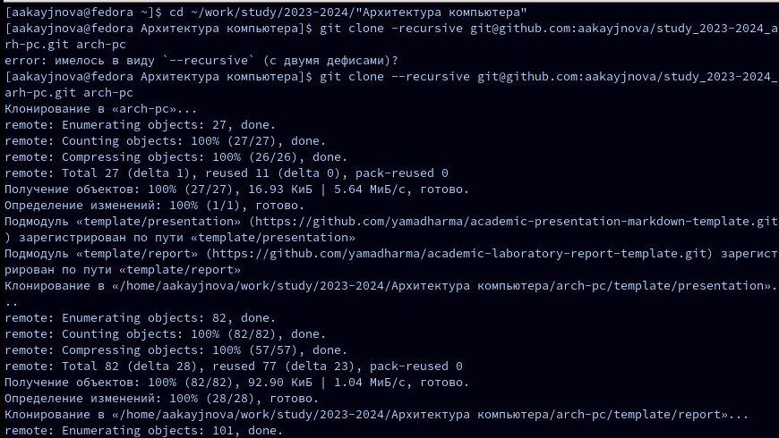{#fig:0016 width=70%}

## Настройка каталога курса

- Переходим в каталог arch-pc
{#fig:0017 width=70%}

- Удаляем лишние файлы
{#fig:0018 width=70%}

- Создаём необходимые каталоги
{#fig:0019 width=70%}

- Добавляем все созданные в ходе работы каталоги и сохраняем изменения на сервере
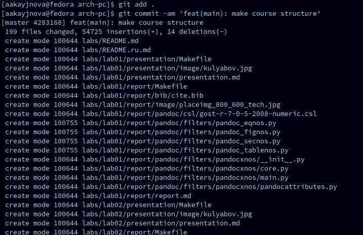{#fig:0020 width=70%}

- Отправляем всё на сервер
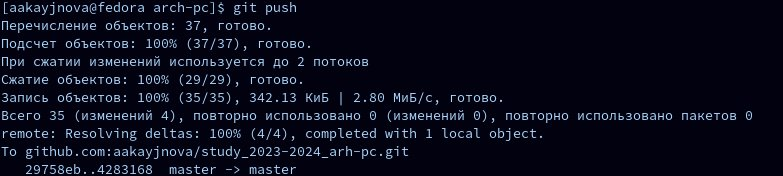{#fig:0021 width=70%}

- Проверяем правильность выполнения работы на Github
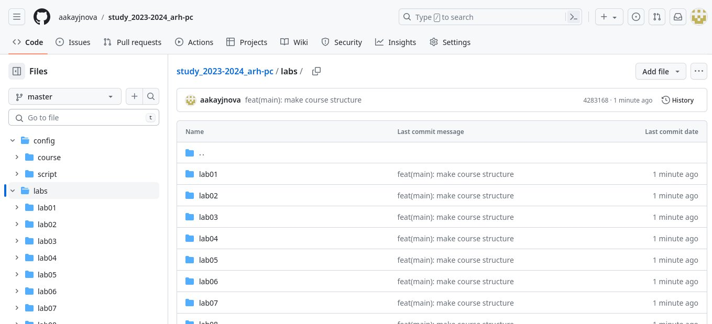{#fig:0022 width=70%}

## Выполнение заданий для самостоятельной работы

1. Отчёт по выполнению лабораторной работы в соответствующем каталоге рабочего пространства

- Переходим в директорию labs/lab02/report и создаём файл для отчёта по второй лабораторной работе
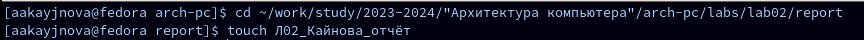{#fig:0023 width=70%}

- Оформляем отчёт в текстовом редакторе LibreOffice Writer, найдя его в меню приложений
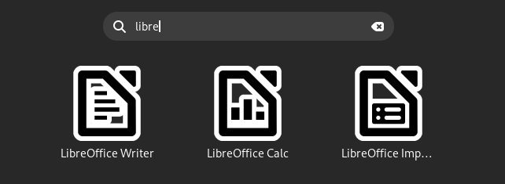{#fig:0024 width=70%}

2. Копирование отчёта предыдущей лабораторной работы в соответствующие каталоги рабочего пространства

- Переходим в подкаталог lab01/report
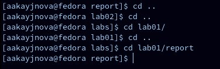{#fig:0025 width=70%}

- Проверяем местонахождение файла с первой лабораторной работой
{#fig:0026 width=70%}

- Копируем первую лабораторную работу и проверяем правильность выполнения команды
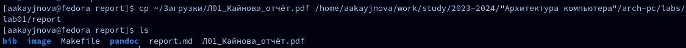{#fig:0027 width=70%}

- Добавляем созданные файлы на сервер
{#fig:0028 width=70%}

- Сохраняем изменения на сервере
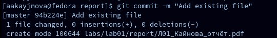{#fig:0029 width=70%}

3. Загрузка файлов на Github

- Отправляем в центральный репозиторий сохранённые изменения
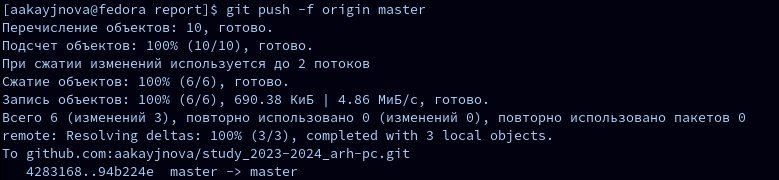{#fig:0030 width=70%}

- Проверяем правильность выполнения работы на Github
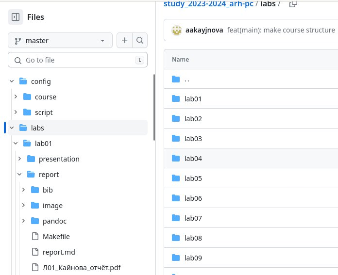{#fig:0031 width=70%}

# Выводы

В ходе данной лабораторной работы мы изучили структуру систем контроля версий и научились применять средства контроля версий по работе с ситемой Git.

# Список литературы{.unnumbered}

1. [Архитектура ЭВМ] (https://esystem.rudn.ru/pluginfile.php/2089082/mod_resource/content/0/%D0%9B%D0%B0%D0%B1%D0%BE%D1%80%D0%B0%D1%82%D0%BE%D1%80%D0%BD%D0%B0%D1%8F%20%D1%80%D0%B0%D0%B1%D0%BE%D1%82%D0%B0%20%E2%84%962.%20%D0%A1%D0%B8%D1%81%D1%82%D0%B5%D0%BC%D0%B0%20%D0%BA%D0%BE%D0%BD%D1%82%D1%80%D0%BE%D0%BB%D1%8F%20%D0%B2%D0%B5%D1%80%D1%81%D0%B8%D0%B9%20Git.pdf)
