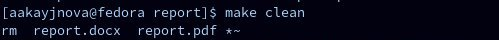

---
## Front matter
title: "Шаблон отчёта по лабораторной работе №3"
subtitle: "Дисциплина: архитектура компьютера"
author: "Кайнова Алина Андреевна"

## Generic otions
lang: ru-RU
toc-title: "Содержание"

## Bibliography
bibliography: bib/cite.bib
csl: pandoc/csl/gost-r-7-0-5-2008-numeric.csl

## Pdf output format
toc: true # Table of contents
toc-depth: 2
lof: true # List of figures
fontsize: 12pt
linectretch: 1.5
papersize: a4
documentclass: scrreprt
## I18n polyglossia
polyglossia-lang:
  name: russian
  options:
	- spelling=modern
	- babelshorthands=true
polyglossia-otherlangs:
  name: english
## I18n babel
babel-lang: russian
babel-otherlangs: english
## Fonts
mainfont: PT Serif
romanfont: PT Serif
sansfont: PT Sans
monofont: PT Mono
mainfontoptions: Ligatures=TeX
romanfontoptions: Ligatures=TeX
sansfontoptions: Ligatures=TeX,Scale=MatchLowercase
monofontoptions: Scale=MatchLowercase,Scale=0.9
## Biblatex
biblatex: true
biblio-style: "gost-numeric"
biblatexoptions:
  - parentracker=true
  - backend=biber
  - hyperref=auto
  - language=auto
  - autolang=other*
  - citestyle=gost-numeric
## Pandoc-crossref LaTeX customization
figureTitle: "Рис."
tableTitle: "Таблица"
listingTitle: "Листинг"
lofTitle: "Список иллюстраций"
lotTitle: "Список таблиц"
lolTitle: "Листинги"
## Misc options
indent: true
header-includes:
  - \usepackage{indentfirst}
  - \usepackage{float} # keep figures where there are in the text
  - \floatplacement{figure}{H} # keep figures where there are in the text
---

# Цель работы

Освоить порядок оформления отчётов с помощью легковесного языка разметки Markdown.

# Задание

	1.Заполнение отчета по выполнению лабораторной работы №3 с помощью языка разметки Markdown
	2. Задания для самостоятельной работы

# Теоретическое введение

Markdown - легковесный язык разметки, созданный с целью обозначения форматирования в простом тексте, с максимальным сохранением его читаемости человеком, и пригодный для машинного преобразования в языки для продвинутых публикаций. Внутритекстовые формулы делаются аналогично формулам LaTeX. В Markdown вставить изображение в документ можно с помощью непосредственного указания адреса изображения. Синтаксис Markdown для встроенной ссылки состоит из части [link text], представляющей текст гиперссылки, и части (file-name.md) – URL-адреса или имени файла, на который дается ссылка. Markdown поддерживает как встраивание фрагментов кода в предложение, так и их размещение между предложениями в виде отдельных огражденных блоков. Огражденные блоки кода — это простой способ выделить синтаксис для фрагментов кода.

# Выполнение лабораторной работы

## Заполнение отчета по выполнению лабораторной работы №3 с помощью языка разметки Markdown

- Перейдём в каталог курса, сформированный при выполнении лабораторной работы №2
{ #fig:fig1 width=90% }

- Обновим локальный репозиторий, скачав изменения из удалённого репозитория на Github
{ #fig:fig2 width=90% }

- Перейдём в каталог с шаблоном отчёта по лабораторной работе №4
{ #fig:fig3 width=90% }

- Скомпилируем шаблон с использованием Makefile
{ #fig:fig4 width=90% }

- Проверяем правильность выполнения команды
{ #fig:fig5 width=90% } 

- Откроем сгенерированный файл report.docx в LibreOffice
{ #fig:fig6 width=90% } 

- Откроем сгенерированный файл report.pdf
{ #fig:fig7 width=90% }

- Удаляем полученные файлы с использованием Makefile
{ #fig:fig8 width=90% }

- Проверим правильность удаления файлов
{ #fig:fig9 width=90% }

- Откроем файл report.md с помощью gedit и начнём заполнять отчёт с помощью Markdown
{ #fig:fig10 width=90% }

## Задания для самостоятельной работы

- Перейдём в директорию lab02/report, чтобы там заполнять отчёт по второй лабораторной работе
{ #fig:fig11 width=90% }

- Скопируем файл report.md с новым именем для заполнения отчёта
{ #fig:fig12 width=90% }

- Скомпилируем файл с отчётом по лабораторной работе
{ #fig:fig13 width=90% }

- Удалим лишние сгенерированный файлы 
{ #fig:fig14 width=90% } 

- Проверим правильность удаления файлов 
{ #fig:fig15 width=90% }

- Добавим и сохраним изменения на Github 
{ #fig:fig16 width=90% }

- Отправим файлы на сервер 
{ #fig:fig17 width=90% }

# Выводы

В ходе данной лабораторной работы мы научились оформлять отчёты с помощью легковесного языка разметки Markdown.

# Список литературы{.unnumbered}

1. [Архитектура ЭВМ] (https://esystem.rudn.ru/pluginfile.php/2089083/mod_resource/content/0/%D0%9B%D0%B0%D0%B1%D0%BE%D1%80%D0%B0%D1%82%D0%BE%D1%80%D0%BD%D0%B0%D1%8F%20%D1%80%D0%B0%D0%B1%D0%BE%D1%82%D0%B0%20%E2%84%963.%20%D0%AF%D0%B7%D1%8B%D0%BA%20%D1%80%D0%B0%D0%B7%D0%BC%D0%B5%D1%82%D0%BA%D0%B8%20.pdf)
