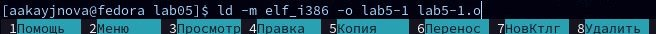
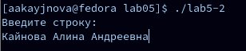

---
## Front matter
title: "Отчёт по лабораторной работе №5"
subtitle: "Дисциплина: архитектура компьютера"
author: "Кайнова Алина Андреевна"

## Generic otions
lang: ru-RU
toc-title: "Содержание"

## Bibliography
bibliography: bib/cite.bib
csl: pandoc/csl/gost-r-7-0-5-2008-numeric.csl

## Pdf output format
toc: true # Table of contents
toc-depth: 2
lof: true # List of figures
fontsize: 12pt
linestretch: 1.5
papersize: a4
documentclass: scrreprt
## I18n polyglossia
polyglossia-lang:
  name: russian
  options:
	- spelling=modern
	- babelshorthands=true
polyglossia-otherlangs:
  name: english
## I18n babel
babel-lang: russian
babel-otherlangs: english
## Fonts
mainfont: PT Serif
romanfont: PT Serif
sansfont: PT Sans
monofont: PT Mono
mainfontoptions: Ligatures=TeX
romanfontoptions: Ligatures=TeX
sansfontoptions: Ligatures=TeX,Scale=MatchLowercase
monofontoptions: Scale=MatchLowercase,Scale=0.9
## Biblatex
biblatex: true
biblio-style: "gost-numeric"
biblatexoptions:
  - parentracker=true
  - backend=biber
  - hyperref=auto
  - language=auto
  - autolang=other*
  - citestyle=gost-numeric
## Pandoc-crossref LaTeX customization
figureTitle: "Рис."
tableTitle: "Таблица"
listingTitle: "Листинг"
lofTitle: "Список иллюстраций"
lolTitle: "Листинги"
## Misc options
indent: true
header-includes:
  - \usepackage{indentfirst}
  - \usepackage{float} # keep figures where there are in the text
  - \floatplacement{figure}{H} # keep figures where there are in the text
---

# Цель работы

Приобрести навыки по работе в программе Midnight Commander и освоить инструкции языка ассемблера NASM.

# Задание

1. Основы работы с mc
2. Структура программы на языке ассемблера NASM
3. Подключение внешнего файла
4. Выполнение заданий для самостоятельной работы

# Теоретическое введение

	Midnight Commander (или просто mc) — это программа, которая позволяет просматривать структуру каталогов и выполнять основные операции по управлению файловой системой, т.е. mc является файловым менеджером. Midnight Commander позволяет сделать работу с файлами более удобной и наглядной. Программа на языке ассемблера NASM, как правило, состоит из трёх секций: секция кода программы (SECTION .text), секция инициированных (известных во время компиляции) данных (SECTION .data) и секция неинициализированных данных (тех, под которые во время компиляции только отводится память, а значение присваивается в ходе выполнения программы) (SECTION .bss). Для объявления инициированных данных в секции .data используются директивы DB, DW, DD, DQ и DT, которые резервируют память и указывают, какие значения должны храниться в этой памяти: - DB (define byte) — определяет переменную размером в 1 байт; - DW (define word) — определяет переменную размеров в 2 байта (слово); - DD (define double word) — определяет переменную размером в 4 байта (двойное слово); - DQ (define quad word) — определяет переменную размером в 8 байт (учетве- рённое слово); - DT (define ten bytes) — определяет переменную размером в 10 байт. Директивы используются для объявления простых переменных и для объявления массивов. Для определения строк принято использовать директиву DB в связи с особенностями хранения данных в оперативной памяти. Инструкция языка ассемблера mov предназначена для дублирования данных источника в приёмнике.
mov dst,src
Здесь операнд dst — приёмник, а src — источник. В качестве операнда могут выступать регистры (register), ячейки памяти (memory) и непосредственные значения (const). Инструкция языка ассемблера intпредназначена для вызова прерывания с указанным номером.
int n
Здесь n — номер прерывания, принадлежащий диапазону 0–255. При программировании в Linux с использованием вызовов ядра sys_calls n=80h (принято задавать в шестнадцатеричной системе счисления).

# Выполнение лабораторной работы

##Основы работы с mc 

Ввожу в терминал mc, чтобы открыть Midnight Commander

{#fig:001 width=70%}

Перехожу в каталог arch-pc, используя mc 

{#fig:002 width=70%}

Создаю каталог lab05 

{#fig:003 width=70%}

Перехожу в созданный каталог

{#fig:004 width=70%}

Создаю файл lab5-1.asm в котором дальше буду работать

{#fig:005 width=70%}

##Структура программы на языке ассемблера NASM

Открываю созданный файл в редакторе nano

{#fig:006 width=70%}

Копирую в файл код программы для запроса строки у пользователя

{#fig:007 width=70%}

Открываю файл для проверки содержания нужного текста

{#fig:008 width=70%}

Транслирую текст программы файла в объектный файл: создаётся lab5-1.o

{#fig:009 width=70%}

Выполняю компоновку объектного файла: создаётся исполняемый файл lab5-1

{#fig:0010 width=70%}

Запускаю исполняемый файл и ввожу свои ФИО

{#fig:0011 width=70%}

##Подключение внешнего файла

Нахожу в каталоге "Загрузки" скачанный файл in_out.asm

{#fig:0012 width=70%}

Копирую этот файл в каталог lab05

{#fig:0013 width=70%}

Копирую файл lab5-1.asm в тот же каталог на с другим именем: lab5-2.asm

{#fig:0014 width=70%}

Изменяю содержимое файла lab5-2.asm в редакторе nano, чтобы использовать подпрограммы из файла in_out.asm

{#fig:0015 width=70%}

Транслирую текст программы файла в объектный файл: создаётся файл lab5-2.o

{#fig:0016 width=70%}

Выполняю компоновку объектного файла: создаётся исполняемый файл lab5-2

{#fig:0017 width=70%}

Запускаю исполняемый файл и ввожу свои ФИО

{#fig:0018 width=70%}

Открываю файл lab5-2.asm для редактирования в nano, изменяю подпрограмму sprintLF на sprint и открываю файл для просмотра сохранённых изменений

{#fig:0019 width=70%}

Транслирую текст программы файла в объектный файл lab5-2.o, выполняю компоновку созданного файла(создаётся lab5-2-2) и проверяю правильность всех выполненных действий

{#fig:0020 width=70%}

Запускаю исполняемый файл и ввожу свои ФИО

{#fig:0021 width=70%}

Разница между первым исполняемым файлом lab6-2 и вторым lab6-2-2 состоит в том, что запуск первого запрашивает ввод с новой строки, а программа, которая исполняется при запуске второго, запрашивает ввод без переноса на новую строку, потому что в этом заключается различие между подпрограммами sprintLF и sprint.

##Выполнение заданий для самостоятельной работы

Создаю копию файла lab5-1.asm с именем lab5-1-1.asm

{#fig:0022 width=70%}

Открываю созданный файл для редактирования и изменяю программу так, чтобы она ещё выводила введённую пользователем строку

{#fig:0023 width=70%}

Транслирую текст программы файла в объектный файл: создаётся файл lab5-1-1.o

{#fig:0024 width=70%}

Выполняю компоновку объектного файла: создаётся исполняемый файл lab5-1-1

{#fig:0025 width=70%}

Запускаю исполняемый файл

{#fig:0026 width=70%}

Создаю копию файла lab5-2.asm с именем lab5-2-1.asm

{#fig:0027 width=70%}

Открываю созданный файл и изменяю программу так, чтобы она выводила ещё и введённую пользователем строку

{#fig:0028 width=70%}

Транслирую текст программы файла в объектный файл: создаётся файл lab5-2-1.o (на скриншоте ошибка:должен быть lab-2-1.asm; потом создалосб всё правильно: на следующем снимке экрана это будет видно, там будет нужный файл)

{#fig:0029 width=70%}

Выполняю компоновку объектного файла: создаётся исполняемый файл lab5-1-1

{#fig:0030 width=70%}

Запускаю исполняемый файл

{#fig:0031 width=70%}

# Выводы

В ходе данной лабораторной работы мы научились работать с Midnight Commander и освоили язык ассемблера NASM.

# Список литературы{.unnumbered}

1. https://esystem.rudn.ru/pluginfile.php/2089085/mod_resource/content/0/%D0%9B%D0%B0%D0%B1%D0%BE%D1%80%D0%B0%D1%82%D0%BE%D1%80%D0%BD%D0%B0%D1%8F%20%D1%80%D0%B0%D0%B1%D0%BE%D1%82%D0%B0%20%E2%84%965.%20%D0%9E%D1%81%D0%BD%D0%BE%D0%B2%D1%8B%20%D1%80%D0%B0%D0%B1%D0%BE%D1%82%D1%8B%20%D1%81%20Midnight%20Commander%20%28%29.%20%D0%A1%D1%82%D1%80%D1%83%D0%BA%D1%82%D1%83%D1%80%D0%B0%20%D0%BF%D1%80%D0%BE%D0%B3%D1%80%D0%B0%D0%BC%D0%BC%D1%8B%20%D0%BD%D0%B0%20%D1%8F%D0%B7%D1%8B%D0%BA%D0%B5%20%D0%B0%D1%81%D1%81%D0%B5%D0%BC%D0%B1%D0%BB%D0%B5%D1%80%D0%B0%20NASM.%20%D0%A1%D0%B8%D1%81%D1%82%D0%B5%D0%BC%D0%BD%D1%8B%D0%B5%20%D0%B2%D1%8B%D0%B7%D0%BE%D0%B2%D1%8B%20%D0%B2%20%D0%9E%D0%A1%20GNU%20Linux.pdf
