---
## Front matter
title: "Отчёт по лабораторной работе №6"
subtitle: "Дисциплина: архитектура компьютера"
author: "Кайнова Алина Андреевна"

## Generic otions
lang: ru-RU
toc-title: "Содержание"

## Bibliography
bibliography: bib/cite.bib
csl: pandoc/csl/gost-r-7-0-5-2008-numeric.csl

## Pdf output format
toc: true # Table of contents
toc-depth: 2
lof: true # List of figures
fontsize: 12pt
linestretch: 1.5
papersize: a4
documentclass: scrreprt
## I18n polyglossia
polyglossia-lang:
  name: russian
  options:
	- spelling=modern
	- babelshorthands=true
polyglossia-otherlangs:
  name: english
## I18n babel
babel-lang: russian
babel-otherlangs: english
## Fonts
mainfont: PT Serif
romanfont: PT Serif
sansfont: PT Sans
monofont: PT Mono
mainfontoptions: Ligatures=TeX
romanfontoptions: Ligatures=TeX
sansfontoptions: Ligatures=TeX,Scale=MatchLowercase
monofontoptions: Scale=MatchLowercase,Scale=0.9
## Biblatex
biblatex: true
biblio-style: "gost-numeric"
biblatexoptions:
  - parentracker=true
  - backend=biber
  - hyperref=auto
  - language=auto
  - autolang=other*
  - citestyle=gost-numeric
## Pandoc-crossref LaTeX customization
figureTitle: "Рис."
tableTitle: "Таблица"
listingTitle: "Листинг"
lofTitle: "Список иллюстраций"
lolTitle: "Листинги"
## Misc options
indent: true
header-includes:
  - \usepackage{indentfirst}
  - \usepackage{float} # keep figures where there are in the text
  - \floatplacement{figure}{H} # keep figures where there are in the text
---

# Цель работы

Освоить арифметические инструкции ассемблера NASM.

# Задание

1. Символьные и численные данные в NASM
2. Выполнение арифметических операций в NASM
3. Выполнение заданий для самостоятельной работы

# Теоретическое введение

Большинство инструкций на языке ассемблера требуют обработки операндов. Адрес операнда предоставляет место, где хранятся данные, подлежащие обработке. Это могут быть данные хранящиеся в регистре или в ячейке памяти. - Регистровая адресация – операнды хранятся в регистрах и в команде используются имена этих регистров, например: mov ax,bx. - Непосредственная адресация – значение операнда задается непосредственно в команде, Например: mov ax,2. - Адресация памяти – операнд задает адрес в памяти. В команде указывается
символическое обозначение ячейки памяти, над содержимым которой требуется выполнить операцию. Ввод информации с клавиатуры и вывод её на экран осуществляется в символьном виде. Кодирование этой информации производится согласно кодовой таблице символов ASCII. ASCII - сокращение от American Standard Code for Information Interchange (Американский стандартный код для обмена информацией). Согласно стандарту ASCII каждый символ кодируется одним байтом. Среди инструкций NASM нет такой, которая выводит числа (не в символьном виде). Поэтому, например, чтобы вывести число, надо предварительно преобразовать его цифры в ASCII-коды этих цифр и выводить на экран эти коды, а не само число. Если же выводить число на экран непосредственно, то экран воспримет его не как число,а как последовательность ASCII-символов – каждый байт числа будет воспринят как один ASCII-символ – и выведет на экран эти символы. Аналогичная ситуация происходит и при вводе данных с клавиатуры. Введенные данные будут представлять собой символы, что сделает невозможным получение корректного результата при выполнении над ними арифметических операций. Для решения этой проблемы необходимо проводить преобразование ASCII символов в числа и обратно.

# Выполнение лабораторной работы

##Символьные и численные данные в NASM

Создаю каталог для лабораторной работы №7 и перехожу в него

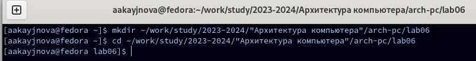{#fig:001 width=70%}

Создаю файл lab6-1.asm

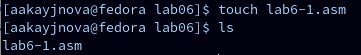{#fig:002 width=70%}

Копирую файл in_out.asm в текущий каталог

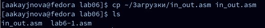{#fig:003 width=70%}

Открываю созданный файл и копирую в него программу вывода значения регистра eax

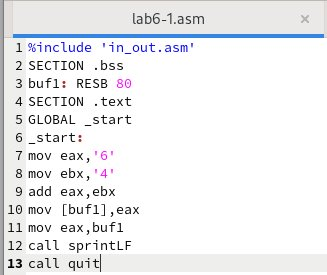{#fig:004 width=70%}

Создаю исполняемый файл и запускаю его

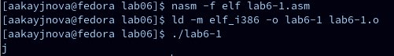{#fig:005 width=70%}

Изменяю в тексте программы в файле lab6-1.asm символы "6" и "4" на цифры 6 и 4 соответственно

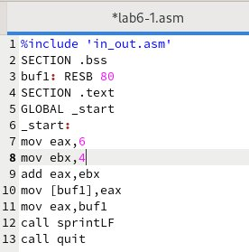{#fig:006 width=70%}

Создаю новый исполняемый файл программы и запускаю его

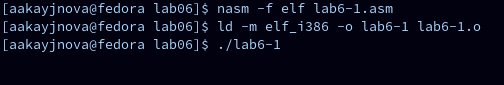{#fig:007 width=70%}

Создаю новый файл lab6-2.asm

{#fig:008 width=70%}

Вставляю в файл текст другой программы для вывода значения eax

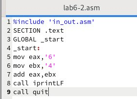{#fig:009 width=70%}https://esystem.rudn.ru/pluginfile.php/2089086/mod_resource/content/0/%D0%9B%D0%B0%D0%B1%D0%BE%D1%80%D0%B0%D1%82%D0%BE%D1%80%D0%BD%D0%B0%D1%8F%20%D1%80%D0%B0%D0%B1%D0%BE%D1%82%D0%B0%20%E2%84%966.%20%D0%90%D1%80%D0%B8%D1%84%D0%BC%D0%B5%D1%82%D0%B8%D1%87%D0%B5%D1%81%D0%BA%D0%B8%D0%B5%20%D0%BE%D0%BF%D0%B5%D1%80%D0%B0%D1%86%D0%B8%D0%B8%20%D0%B2%20NASM..pdf

Создаю и запускаю исполняемый файл lab6-2

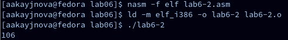{#fig:0010 width=70%}

Изменяю в тексте программы в файле lab6-2.asm символы "6" и "4" на цифры 6 и 4 соответственно

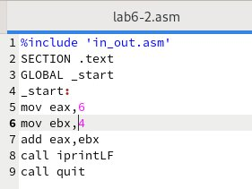{#fig:0011 width=70%}

Создаю и запускаю исполняемый файл

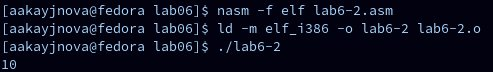{#fig:0012 width=70%}

Заменяю функцию iprintLF на iprint в тексте программы. Вывод не изменился, так как символ переноса строки не отображался, когда программа иполнялась с функцией iprintLF, а iprint не добавляет к выводу символ переноса строки, в отличие от iprintLF

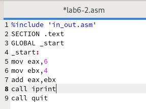{#fig:0013 width=70%}

Создаю и запускаю новый исполняемый файл

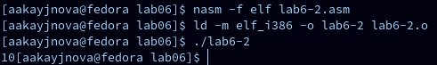{#fig:0014 width=70%}

## Выполнение арифметических операций в NASM

Создаю файл lab6-3.asm

{#fig:0015 width=70%}

Ввожу в созданный файл текст программы для вычисления значения выражения f(x)=(5*2+3)/3

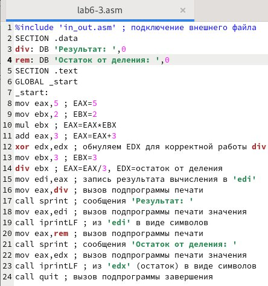{#fig:0016 width=70%}

Создаю исполняемый файл и запускаю его

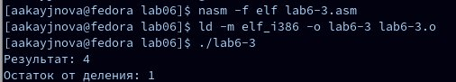{#fig:0017 width=70%}

Изменяю текст программы, чтобы вычислить значение выражения f(x)=(4*6+2)/5

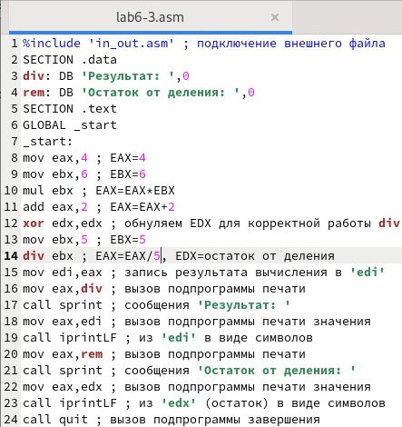{#fig:0018 width=70%}

Создаю и запускаю новый исполняемый файл

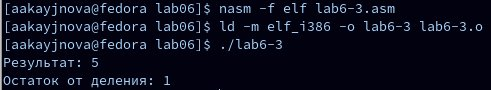{#fig:0019 width=70%}

Создаю файл variant.asm

{#fig:0020 width=70%}

Ввожу в файл текст программы для вычисления варианта задания по номеру студенческого билета

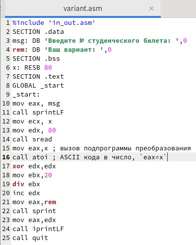{#fig:0021 width=70%}

Создаю и запускаю исполняемый файл, ввожу номер своего студ. билета

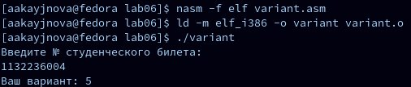{#fig:0022 width=70%}

### Ответы на вопросы по программе

1. За вывод на экран сообщения "Ваш вариант" отвечают строки кода:

mov eax, rem
call sprint

2. Инструкция mov ecx,x используется, чтобы включить адрес вводимой строки x в регистр; 
ecx mov edx,80 - это запись в регистр edx длины вводимой строки;
call sread - это вызов подпрограммы из внешнего файла, обеспечивающей ввод сообщения с клавиатуры.

3. Инструкция call atoi используется для вызова из внешнего файла подпрограммы, преобразующей ASCII-код символа в целое число и записывающей результат в регистр eax.

4. За вычисление варианта отвечают строки листинга:

xor edx,edx ; обнуление edx для корректной работы div
mov ebx,20 ; ebx = 20
div ebx ; eax = eax/20, edx - остаток от деления
inc edx ; edx = edx + 1

5. При выполнении инструкции div ebx остаток от деления записывается в регистр edx.

6. Инструкция inc edx увеличивает значение регистра edx на 1.

7. За вывод на экран результата вычислений отвечают строки листинга:

mov eax, edx
call iprintLF

## Выполнение заданий для самостоятельной работы

Создаю файл lab6-4.asm 

{#fig:0023 width=70%}

Записываю в созданный файл текст программы для вычиления значения выражения под вариантом 5 (9*x-8)/8

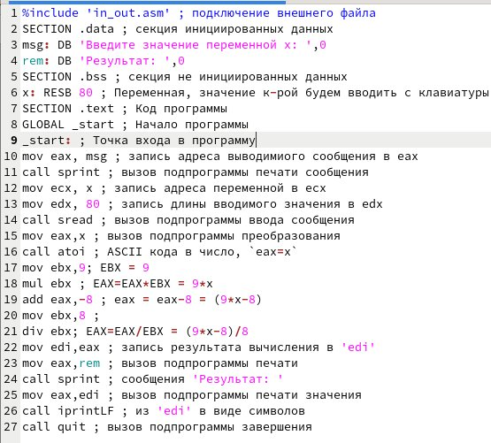{#fig:0024 width=70%}

Создаю и запускаю исполняемый файл, ввожу значение 8

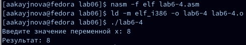{#fig:0025 width=70%}

Ввожу другое значение x

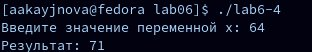{#fig:0026 width=70%}

# Выводы

В ходе данной лабораторной работы мы научились работать с арифметическими инструкциями языка ассмеблера NASM.

# Список литературы{.unnumbered}

1. https://esystem.rudn.ru/pluginfile.php/2089086/mod_resource/content/0/%D0%9B%D0%B0%D0%B1%D0%BE%D1%80%D0%B0%D1%82%D0%BE%D1%80%D0%BD%D0%B0%D1%8F%20%D1%80%D0%B0%D0%B1%D0%BE%D1%82%D0%B0%20%E2%84%966.%20%D0%90%D1%80%D0%B8%D1%84%D0%BC%D0%B5%D1%82%D0%B8%D1%87%D0%B5%D1%81%D0%BA%D0%B8%D0%B5%20%D0%BE%D0%BF%D0%B5%D1%80%D0%B0%D1%86%D0%B8%D0%B8%20%D0%B2%20NASM..pdf
