---
## Front matter
title: "Отчёт по лабораторной работе №7"
subtitle: "Дисциплина: архитектура компьютера"
author: "Кайнова Алина Андреевна"

## Generic otions
lang: ru-RU
toc-title: "Содержание"

## Bibliography
bibliography: bib/cite.bib
csl: pandoc/csl/gost-r-7-0-5-2008-numeric.csl

## Pdf output format
toc: true # Table of contents
toc-depth: 2
lof: true # List of figures
fontsize: 12pt
linestretch: 1.5
papersize: a4
documentclass: scrreprt
## I18n polyglossia
polyglossia-lang:
  name: russian
  options:
	- spelling=modern
	- babelshorthands=true
polyglossia-otherlangs:
  name: english
## I18n babel
babel-lang: russian
babel-otherlangs: english
## Fonts
mainfont: PT Serif
romanfont: PT Serif
sansfont: PT Sans
monofont: PT Mono
mainfontoptions: Ligatures=TeX
romanfontoptions: Ligatures=TeX
sansfontoptions: Ligatures=TeX,Scale=MatchLowercase
monofontoptions: Scale=MatchLowercase,Scale=0.9
## Biblatex
biblatex: true
biblio-style: "gost-numeric"
biblatexoptions:
  - parentracker=true
  - backend=biber
  - hyperref=auto
  - language=auto
  - autolang=other*
  - citestyle=gost-numeric
## Pandoc-crossref LaTeX customization
figureTitle: "Рис."
tableTitle: "Таблица"
listingTitle: "Листинг"
lofTitle: "Список иллюстраций"
lolTitle: "Листинги"
## Misc options
indent: true
header-includes:
  - \usepackage{indentfirst}
  - \usepackage{float} # keep figures where there are in the text
  - \floatplacement{figure}{H} # keep figures where there are in the text
---

# Цель работы

Изучить команды переходов в ассемблере, приобрести навыки написания программ с обработкой аргументов командной строки и познакомиться с файлом листинга.

# Задание

1. Реализация циклов в NASM
2. Изучение структуры файла листинга
3. Выполнение заданий для самостоятельной работы

# Теоретическое введение

Для реализации ветвлений в ассемблере используются так называемые команды передачи
управления или команды перехода. Можно выделить 2 типа переходов:
• условный переход – выполнение или не выполнение перехода в определенную точку
программы в зависимости от проверки условия.
• безусловный переход – выполнение передачи управления в определенную точку про-
граммы без каких-либо условий.
Безусловный переход выполняется инструкцией jmp (от англ. jump – прыжок), которая
включает в себя адрес перехода, куда следует передать управление. Адрес перехода - это либо метка, либо адрес области памяти. в качестве операнда можно использовать имя регистра, в таком случае переход будет осуществляться по адресу, хранящемуся в этом регистре.
Флаг – это бит, принимающий значение 1 («флаг установлен»), если выполнено некоторое
условие, и значение 0 («флаг сброшен») в противном случае. Флаги работают независимо
друг от друга, и лишь для удобства они помещены в единый регистр — регистр флагов, отра-
жающий текущее состояние процессора. В следующей таблице указано положение битовых
флагов в регистре флагов. Флаги состояния (биты 0, 2, 4, 6, 7 и 11) отражают результат выполнения арифметических
инструкций, таких как ADD, SUB, MUL, DIV.
Интрукция cmp позволяет сравнить операнды и выставляет флаги в зависимости от результата сравнения.
Команда условного перехода имеет вид
j<мнемоника перехода> label
Мнемоника перехода связана со значением анализируемых флагов или со способом фор-
мирования этих флагов.
Команды условного перехода обычно ставятся после
команды сравнения cmp. В их мнемокодах указывается тот результат сравнения, при котором
надо делать переход. Программист выбирает, какую из мнемоник применить, чтобы
получить более простой для понимания текст программы.
Листинг (в рамках понятийного аппарата NASM) — это один из выходных файлов, созда-
ваемых транслятором. Он имеет текстовый вид и нужен при отладке программы, так как
кроме строк самой программы он содержит дополнительную информацию.
се ошибки и предупреждения, обнаруженные при ассемблировании, транслятор выводит
на экран, и файл листинга не создаётся.
Структура листинга:
• номер строки — это номер строки файла листинга (нужно помнить, что номер строки в
файле листинга может не соответствовать номеру строки в файле с исходным текстом
программы);
• адрес — это смещение машинного кода от начала текущего сегмента;
• машинный код представляет собой ассемблированную исходную строку в виде шестна-
дцатеричной последовательности. (например, инструкция int 80h начинается по сме-
щению 00000020 в сегменте кода; далее идёт машинный код, в который ассемблируется
инструкция, то есть инструкция int 80h ассемблируется в CD80 (в шестнадцатеричном
представлении); CD80 — это инструкция на машинном языке, вызывающая прерывание
ядра);
• исходный текст программы — это просто строка исходной программы вместе с ком-
ментариями (некоторые строки на языке ассемблера, например, строки, содержащие
только комментарии, не генерируют никакого машинного кода, и поля «смещение» и
«исходный текст программы» в таких строках отсутствуют, однако номер строки им
присваивается).

# Выполнение лабораторной работы

## Реализация переходов в NASM

Создаю каталог для лабораторной работы №7 и в нём файл lab7-1.asm

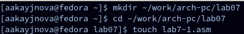{#fig:001 width=70%}

Заполняю файл, вставляя в него текст программы из листинга 7.1

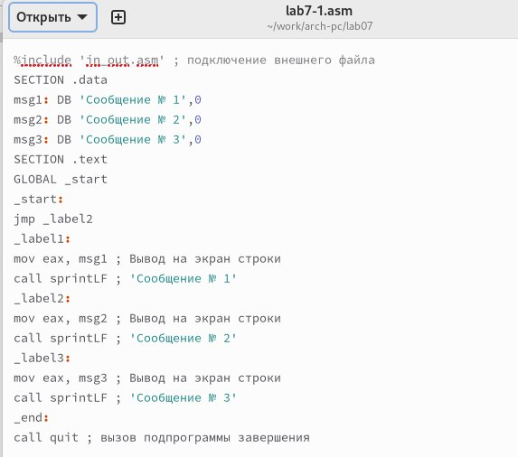{#fig:002 width=70%}

Создаю исполняемый файл и запускаю его

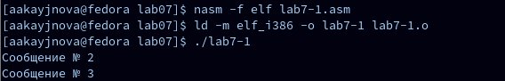{#fig:003 width=70%}

Изменяю текст программы в соответствии с листингом 7.2

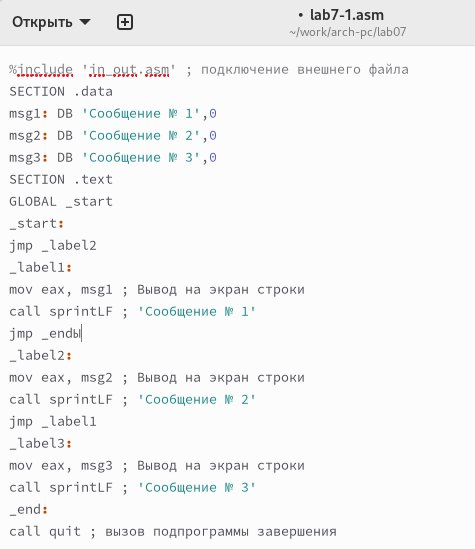{#fig:004 width=70%}

Создаю исполняемый файл и проверяю его работу

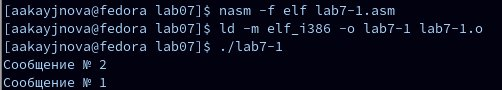{#fig:005 width=70%}

Изменяю текст программы так, чтобы вывод программы соответствовал заданию

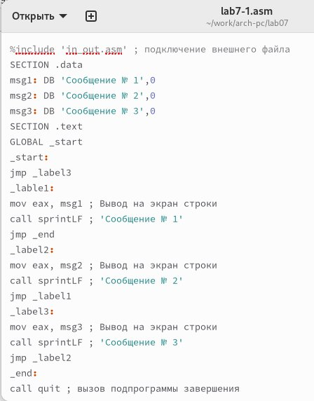{#fig:006 width=70%}

Создаю исполняемый файл и проверяю его работу

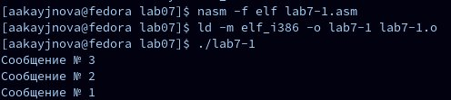{#fig:007 width=70%}

Создаю файл lab7-2.asm 

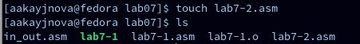{#fig:008 width=70%}

Ввожу в него текст программы из листинга 7.3

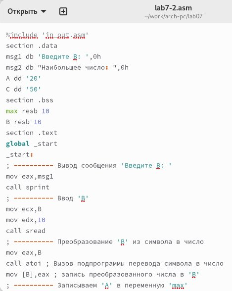{#fig:009 width=70%}

Создаю исполняемый файл и проверяю его работу

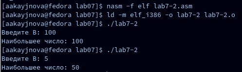{#fig:0010 width=70%}

## Изучение структуры файла листинга

Создаю файл листинга для программы из файла lab7-2.asm и открою созданный файл

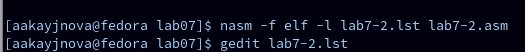{#fig:0011 width=70%}

Изучаю формат и содержимое данного файла листинга

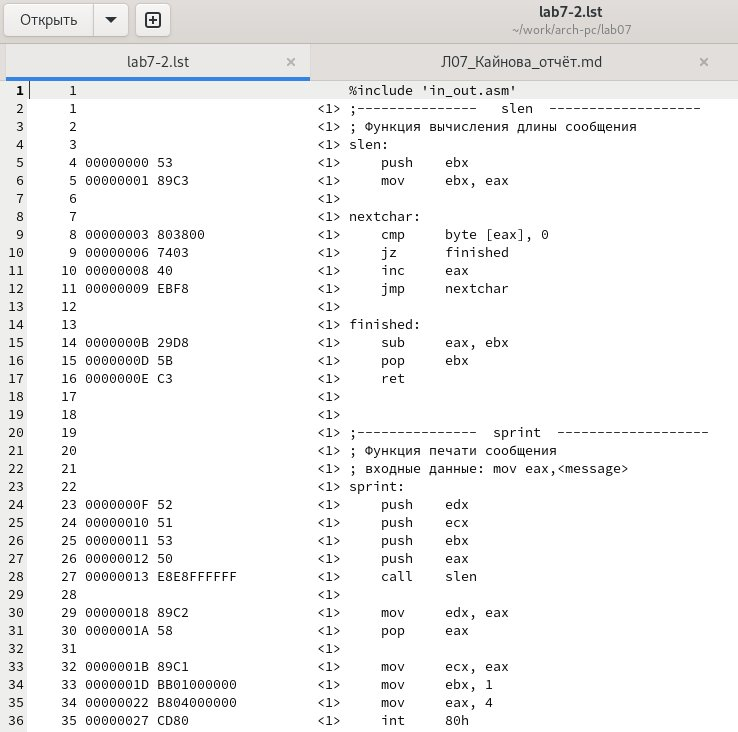{#fig:0012 width=70%}

Представленные три строки содержат следующие данные

{#fig:0013 width=70%}

строка № 2: ";Функция вычисления длины сообщения" - это комментарий к коду, нет адреса и машинного кода;
строка № 3: "slen" - название функции, нет адреса и машинного кода;
строка № 4: "00000000" - адрес строки, "53" - машинный код, "push ebx" - исходный текст программы(push помещает ebx в стек);

Открываю файл листинга и в любой инструкции с двумя операндами удаляю один операнд

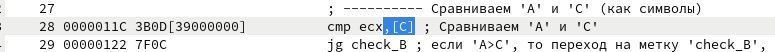{#fig:0014 width=70%}

Выполняю трансляцию с получением файла листинга

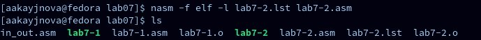{#fig:0015 width=70%}

В этом случае создаётся файл листинга lab7-2.lst и в листинг добавляется операнд, который был удалён ранее

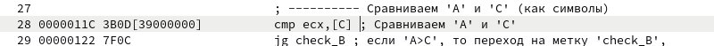{#fig:0016 width=70%}

## Выполнение заданий для самостоятельной работы 

Пишу программу нахождения наименьшей из 3-х целочисленных переменных a, b и c. Значения переменных выбираю из таблицы 7.5 в соответствии с вариантом, полученным в ходе выполнения лабораторной работы № 6. Мой вариант № 5, поэтому мои значения: 54, 62, 87.

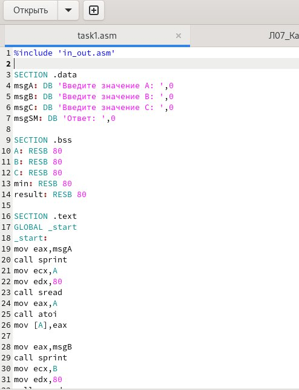{#fig:0017 width=70%}

Текст программы:
%include 'in_out.asm'

SECTION .data
msgA: DB 'Введите значение A: ',0
msgB: DB 'Введите значение B: ',0
msgC: DB 'Введите значение C: ',0
msgSM: DB 'Ответ: ',0

SECTION .bss
A: RESB 80
B: RESB 80
C: RESB 80
min: RESB 80
result: RESB 80

SECTION .text
GLOBAL _start
_start:
mov eax,msgA
call sprint
mov ecx,A
mov edx,80
call sread
mov eax,A
call atoi
mov [A],eax

mov eax,msgB
call sprint
mov ecx,B
mov edx,80
call sread
mov eax,B
call atoi
mov [B],eax

mov eax,msgC
call sprint
mov ecx,C
mov edx,80
call sread
mov eax,C
call atoi
mov [C],eax

mov ecx,[A]
mov [min],ecx

cmp ecx, [B]
jl check_C
mov ecx, [B]
mov [min], ecx

check_C:
cmp ecx, [C]
jl finish
mov ecx,[C]
mov [min],ecx

finish:
mov eax,msgSM
call sprint

mov eax, [min]
call iprintLF

call quit

Создаю исполняемый файл и проверяю его работу

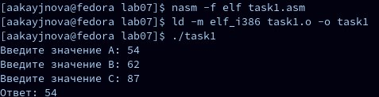{#fig:0018 width=70%}

Код программы работает корректно.

Пишу программу, которая для введёных с клавиатуры значений x и a вычисляет значение заданной функции f(x) и выводит результат вычислений. Мой вариант № 5, поэтому моя функция: 
2(x-a), x>a;
15, x<=a;

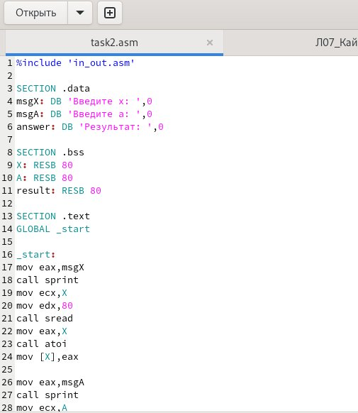{#fig:0019 width=70%}

Текст программы:
%include 'in_out.asm'

SECTION .data
msgX: DB 'Введите x: ',0
msgA: DB 'Введите a: ',0
answer: DB 'Результат: ',0

SECTION .bss
X: RESB 80
A: RESB 80
result: RESB 80

SECTION .text
GLOBAL _start

_start:
mov eax,msgX
call sprint
mov ecx,X
mov edx,80
call sread
mov eax,X
call atoi
mov [X],eax

mov eax,msgA
call sprint
mov ecx,A
mov edx,80
call sread
mov eax,A
call atoi
mov [A],eax

mov ecx,[X]
cmp ecx,[A]
JG first
jmp secon
first:
mov eax,[X]
sub eax,[A]
mov ebx,2
mul ebx
call iprintLF
call quit

second:
mov eax,15
call iprintLF
call quit

Создаю исполняемый файл и проверяю его работу для значений x и a соответственно: (1;2) и (2;1)

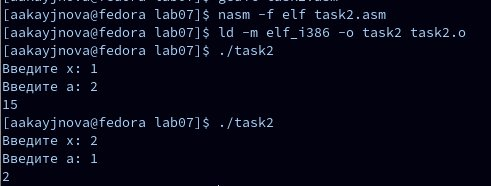{#fig:0020 width=70%}

Код программы работает корректно.

# Выводы

В ходе данной лабораторной работы мы изучили команды условного и безусловного переходов, приобрели навыки написания программ с их использованием и ознакомились со структрой файла листинга.

# Список литературы{.unnumbered}

1. https://esystem.rudn.ru/pluginfile.php/2089087/mod_resource/content/0/%D0%9B%D0%B0%D0%B1%D0%BE%D1%80%D0%B0%D1%82%D0%BE%D1%80%D0%BD%D0%B0%D1%8F%20%D1%80%D0%B0%D0%B1%D0%BE%D1%82%D0%B0%20%E2%84%967.%20%D0%9A%D0%BE%D0%BC%D0%B0%D0%BD%D0%B4%D1%8B%20%D0%B1%D0%B5%D0%B7%D1%83%D1%81%D0%BB%D0%BE%D0%B2%D0%BD%D0%BE%D0%B3%D0%BE%20%D0%B8%20%D1%83%D1%81%D0%BB%D0%BE%D0%B2%D0%BD%D0%BE%D0%B3%D0%BE%20%D0%BF%D0%B5%D1%80%D0%B5%D1%85%D0%BE%D0%B4%D0%BE%D0%B2%20%D0%B2%20Nasm.%20%D0%9F%D1%80%D0%BE%D0%B3%D1%80%D0%B0%D0%BC%D0%BC%D0%B8%D1%80%D0%BE%D0%B2%D0%B0%D0%BD%D0%B8%D0%B5%20%D0%B2%D0%B5%D1%82%D0%B2%D0%BB%D0%B5%D0%BD%D0%B8%D0%B9..pdf
