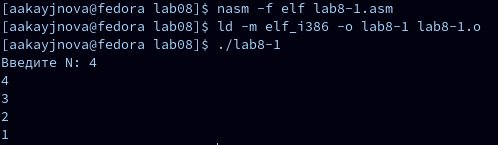

---
## Front matter
title: "Отчёт по лабораторной работе № 8"
subtitle: "Дисциплина: архитектура компьютера"
author: "Кайнова Алина Андреевна"

## Generic otions
lang: ru-RU
toc-title: "Содержание"

## Bibliography
bibliography: bib/cite.bib
csl: pandoc/csl/gost-r-7-0-5-2008-numeric.csl

## Pdf output format
toc: true # Table of contents
toc-depth: 2
lof: true # List of figures
fontsize: 12pt
linestretch: 1.5
papersize: a4
documentclass: scrreprt
## I18n polyglossia
polyglossia-lang:
  name: russian
  options:
	- spelling=modern
	- babelshorthands=true
polyglossia-otherlangs:
  name: english
## I18n babel
babel-lang: russian
babel-otherlangs: english
## Fonts
mainfont: PT Serif
romanfont: PT Serif
sansfont: PT Sans
monofont: PT Mono
mainfontoptions: Ligatures=TeX
romanfontoptions: Ligatures=TeX
sansfontoptions: Ligatures=TeX,Scale=MatchLowercase
monofontoptions: Scale=MatchLowercase,Scale=0.9
## Biblatex
biblatex: true
biblio-style: "gost-numeric"
biblatexoptions:
  - parentracker=true
  - backend=biber
  - hyperref=auto
  - language=auto
  - autolang=other*
  - citestyle=gost-numeric
## Pandoc-crossref LaTeX customization
figureTitle: "Рис."
tableTitle: "Таблица"
listingTitle: "Листинг"
lofTitle: "Список иллюстраций"
lolTitle: "Листинги"
## Misc options
indent: true
header-includes:
  - \usepackage{indentfirst}
  - \usepackage{float} # keep figures where there are in the text
  - \floatplacement{figure}{H} # keep figures where there are in the text
---

# Цель работы

Научиться писать программы с использованием циклов и обработкой аргументов командной строки.

# Задание

1. Реализация циклов в NASM
2. Обработка аргументов командной строки
3. Выполнение заданий для самостоятельной работы

# Теоретическое введение

Стек — это структура данных, организованная по принципу LIFO («Last In
— First Out» или «последним пришёл — первым ушёл»). Стек является частью
архитектуры процессора и реализован на аппаратном уровне. Для работы со
стеком в процессоре есть специальные регистры (ss, bp, sp) и команды. Основной
функцией стека является функция сохранения адресов возврата и передачи
аргументов при вызове процедур. Кроме того, в нём выделяется память для
локальных переменных и могут временно храниться значения регистров. Стек
имеет вершину, адрес последнего добавленного элемента, который хранится в
регистре esp (указатель стека). Противоположный конец стека называется дном.
Значение, помещённое в стек последним, извлекается первым. При помещении
значения в стек указатель стека уменьшается, а при извлечении — увеличивается.
Команда push размещает значение в стеке, т.е. помещает значение в ячейку
памяти, на которую указывает регистр esp, после этого значение регистра esp
увеличивается на 4. Данная команда имеет один операнд — значение, которое
необходимо поместить в стек.
Команда pop извлекает значение из стека, т.е. извлекает значение из ячейки
памяти, на которую указывает регистр esp, после этого уменьшает значение реги-
стра esp на 4. У этой команды также один операнд, который может быть регистром
или переменной в памяти. Нужно помнить, что извлечённый из стека элемент
не стирается из памяти и остаётся как “мусор”, который будет перезаписан при
записи нового значения в стек.
Для организации циклов существуют специальные инструкции. Для всех ин-
7струкций максимальное количество проходов задаётся в регистре ecx. Наиболее
простой является инструкция loop. Она позволяет организовать безусловный
цикл.

# Выполнение лабораторной работы

## Реализация циклов в NASM 

Создаю каталог для данной лабораторной работы и файл lab8-1.asm

{#fig:001 width=70%}

Ввожу в созданный файл текст программы из листинга 8.1

{#fig:002 width=70%}

Создаю исполняемый файл и проверяю его работу

{#fig:003 width=70%}

Программа выводит числа от N до 1 включительно.

Изменяю текст программы, изменив значение регистра ecx в цикле

{#fig:004 width=70%}

Создаю исполняемый файл и проверяю его работу

{#fig:005 width=70%}

Регистр ecx принимает нечётные значения в цикле. Число проходов не соответствует введённому значению N.

Вношу изменения в текст программы, добавив команды push и pop для сохранения значения счётчика цикла loop

{#fig:006 width=70%}

Создаю исполняемый файл и проверяю его работу

{#fig:007 width=70%}

В данном случае число проходов цикла соответствует введённому с клавиатуры значению и выводит числа от N-1 до 0 включительно.

## Обработка агрмуентов командной строки

Создаю файл lab8-2.asm в данном каталоге и ввожу в него текст из программы листинга 8.2

{#fig:008 width=70%}

Создаю исполняемый файл и проверяю его работу

{#fig:009 width=70%}

Программа выводит 4 аргумента, так как аргумент 2 не взят в кавычки, поэтому из-за пробела программа считывает 2 как отдельный аргумент.

Создаю файл lab8-3.asm в данном каталоге и ввожу в него текст программы из листинга 8.3

{#fig:0010 width=70%}

Создаю исполняемый файл и запускаю его, указав аргументы

{#fig:0011 width=70%}

Изменяю текст программы для вычисления произведения аргументов командной строки

{#fig:0012 width=70%}

Создаю исполняемый файл и запускаю его, указав аргументы

{#fig:0013 width=70%}

## Выполнение заданий для самостоятельной работы

Пишу текст программы, которая находит сумму значений функции f(x)=4*x+3 в соответствии с моим вариантом № 5 для значений x=x1,x2,...,xn. Значения xi передаются как аргументы.

{#fig:0014 width=70%}

Создаю исполняемый файл и проверяю его работу на нескольких наборах x=x1,x2,...,xn

{#fig:0015 width=70%}

Программа работает корректно.

# Выводы

В ходе данной лабораторной работы мы приобрели навыки написания программ с использованием циклов и обработкой аргументов командной строки.

# Список литературы{.unnumbered}

1. https://esystem.rudn.ru/pluginfile.php/2089095/mod_resource/content/0/%D0%9B%D0%B0%D0%B1%D0%BE%D1%80%D0%B0%D1%82%D0%BE%D1%80%D0%BD%D0%B0%D1%8F%20%D1%80%D0%B0%D0%B1%D0%BE%D1%82%D0%B0%20%E2%84%968.%20%D0%9F%D1%80%D0%BE%D0%B3%D1%80%D0%B0%D0%BC%D0%BC%D0%B8%D1%80%D0%BE%D0%B2%D0%B0%D0%BD%D0%B8%D0%B5%20%D1%86%D0%B8%D0%BA%D0%BB%D0%B0.%20%D0%9E%D0%B1%D1%80%D0%B0%D0%B1%D0%BE%D1%82%D0%BA%D0%B0%20%D0%B0%D1%80%D0%B3%D1%83%D0%BC%D0%B5%D0%BD%D1%82%D0%BE%D0%B2%20%D0%BA%D0%BE%D0%BC%D0%B0%D0%BD%D0%B4%D0%BD%D0%BE%D0%B9%20%D1%81%D1%82%D1%80%D0%BE%D0%BA%D0%B8..pdf
:::
