---
## Front matter
title: "Отчёт по лабораторной работе № 9"
subtitle: "Дисциплина: архитектура компьютера"
author: "Кайнова Алина Андреевна"

## Generic otions
lang: ru-RU
toc-title: "Содержание"

## Bibliography
bibliography: bib/cite.bib
csl: pandoc/csl/gost-r-7-0-5-2008-numeric.csl

## Pdf output format
toc: true # Table of contents
toc-depth: 2
lof: true # List of figures
fontsize: 12pt
linestretch: 1.5
papersize: a4
documentclass: scrreprt
## I18n polyglossia
polyglossia-lang:
  name: russian
  options:
	- spelling=modern
	- babelshorthands=true
polyglossia-otherlangs:
  name: english
## I18n babel
babel-lang: russian
babel-otherlangs: english
## Fonts
mainfont: PT Serif
romanfont: PT Serif
sansfont: PT Sans
monofont: PT Mono
mainfontoptions: Ligatures=TeX
romanfontoptions: Ligatures=TeX
sansfontoptions: Ligatures=TeX,Scale=MatchLowercase
monofontoptions: Scale=MatchLowercase,Scale=0.9
## Biblatex
biblatex: true
biblio-style: "gost-numeric"
biblatexoptions:
  - parentracker=true
  - backend=biber
  - hyperref=auto
  - language=auto
  - autolang=other*
  - citestyle=gost-numeric
## Pandoc-crossref LaTeX customization
figureTitle: "Рис."
tableTitle: "Таблица"
listingTitle: "Листинг"
lofTitle: "Список иллюстраций"
lolTitle: "Листинги"
## Misc options
indent: true
header-includes:
  - \usepackage{indentfirst}
  - \usepackage{float} # keep figures where there are in the text
  - \floatplacement{figure}{H} # keep figures where there are in the text
---

# Цель работы

Приобрест навыки написания программ с использованием подпрограмм и познакомиться с методами отладки при помощи GDB и с его основными возможностями.

# Задание

1. Реализация подпрограмм в NASM
2. Отладка программ с помощью GDB
3. Добавление точек останова
4. Работа с данными программы в GDB
5. Обработка аргументов командной строки в GDB
6. Выполнение заданий для самостоятельной работы

# Теоретическое введение

Отладка — это процесс поиска и исправления ошибок в программе. Отладчики позволяют управлять ходом выполнения программы, контролировать и
изменять данные. Это помогает быстрее найти место ошибки в программе и ускорить её исправление. Наиболее популярные способы работы с отладчиком — это использование точек останова и выполнение программы по шагам. GDB (GNU Debugger — отладчик проекта GNU) работает на многих UNIX-подобных системах и умеет производить отладку многих языков программирования. GDB предлагает обширные средства для слежения и контроля за выполнением компьютерных программ. Отладчик не содержит собственного графического пользовательского интерфейса и использует стандартный текстовый интерфейс консоли. Однако для GDB существует несколько сторонних графических надстроек, а кроме того, некоторые интегрированные среды разработки используют его в качестве базовой подсистемы отладки. Отладчик GDB (как и любой другой отладчик) позволяет увидеть, что происходит «внутри» программы в момент её выполнения или что делает программа в момент сбоя. Команда run (сокращённо r) — запускает отлаживаемую программу в оболочке GDB. Команда kill (сокращённо k) прекращает отладку программы, после чего следует вопрос о прекращении процесса отладки. Если в ответ введено y (то есть «да»), отладка программы прекращается. Командой run её можно начать заново, при этом все точки останова (breakpoints), точки просмотра (watchpoints) и точки отлова (catchpoints) сохраняются.
Для выхода из отладчика используется команда quit (или сокращённо q). Если есть файл с исходным текстом программы, а в исполняемый файл включена информация о номерах строк исходного кода, то программу можно отлаживать, работая в отладчике непосредственно с её исходным текстом. Чтобы программу можно было отлаживать на уровне строк исходного кода, она должна
быть откомпилирована с ключом -g. Установить точку останова можно командой break (кратко b). Типичный аргумент этой команды — место установки. Его можно задать как имя метки или как адрес. Чтобы не было путаницы с номерами, перед адресом ставится «звёздочка».
Информацию о всех установленных точках останова можно вывести командой info (кратко i). Для того чтобы сделать неактивной какую-нибудь ненужную точку останова, можно воспользоваться командой disable. Обратно точка останова активируется командой enable. Если же точка останова в дальнейшем больше не нужна, она может быть удалена с помощью команды delete. Для продолжения остановленной программы используется команда continue (c). Выполнение программы будет происходить до следующей точки останова. В качестве аргумента может использоваться целое число N, которое указывает отладчику проигнорировать N − 1 точку останова (выполнение остановится на N-й точке).
Команда stepi (кратко sI) позволяет выполнять программу по шагам, т.е. данная команда выполняет ровно одну инструкцию. Подпрограмма — это, как правило, функционально законченный участок кода, который можно многократно вызывать из разных мест программы. В отличие от
простых переходов из подпрограмм существует возврат на команду, следующую за вызовом. Если в программе встречается одинаковый участок кода, его можно оформить в виде подпрограммы, а во всех нужных местах поставить её вызов. При этом подпрограмма будет содержаться в коде в одном экземпляре, что позволит уменьшить размер кода всей программы. Для вызова подпрограммы из основной программы используется инструкция call, которая заносит адрес следующей инструкции в стек и загружает в регистр eip адрес соответствующей подпрограммы, осуществляя таким образом переход. Затем начинается выполнение подпрограммы, которая, в свою очередь, также может содержать подпрограммы. Подпрограмма завершается инструкцией ret, которая извлекает из стека адрес, занесённый туда соответствующей инструкцией call, и заносит его в eip. После этого выполнение основной программы возобновится с инструкции, следующей за инструкцией call.

# Выполнение лабораторной работы

## Реализация подпрограмм в NASM

Создаю каталог для выполнения данной лабораторной работы и в нём файл lab09-1.asm

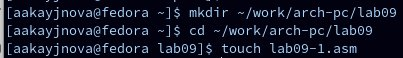{#fig:001 width=70%}

Ввожу в этот файл текст программы с использованием подпрограммы из листинга 9.1

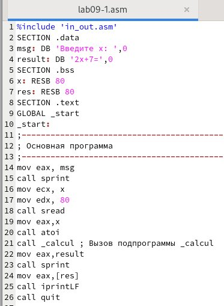{#fig:002 width=70%}

Создаю исполняемый файл и проверяю его работу

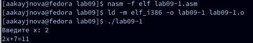{#fig:003 width=70%}

Изменяю текст программы, добавив подпрограмму _subcalcul в подпрограмму _calcul для вычисления выражения f(g(x)), где x вводится с клавиатуры, f(x)=2x+7, g(x)=3x-1

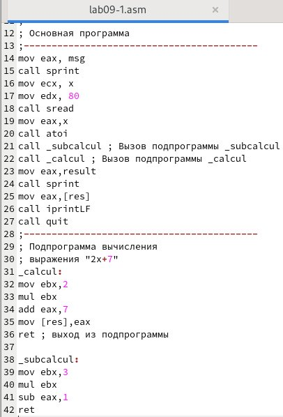{#fig:004 width=70%}

Создаю исполняемый файл и проверяю его работу

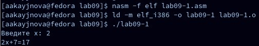{#fig:005 width=70%}

## Отладка программ с помощью GDB

Создаю файл lab09-2.asm и вставляю туда текст программы из листинга 9.2

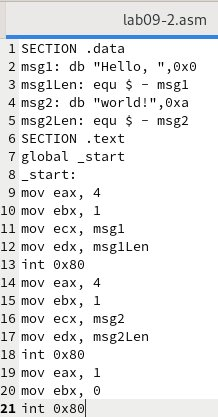{#fig:006 width=70%}

Получаю исполняемый файл для работы с GDB с ключом '-g'

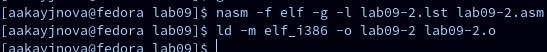{#fig:007 width=70%}

Загружаю исполняемый файл в отладчик GDB

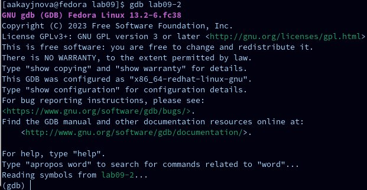{#fig:008 width=70%}

Проверяю работу программы, запустив её в GDB 

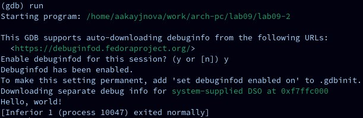{#fig:009 width=70%}

Устанавливаю брейкпоинт на метку _start и запускаю программу для более подробного анализа

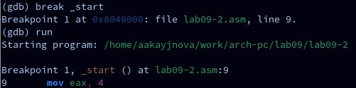{#fig:0010 width=70%}

Просматриваю дисассимилированный код программы начиная с метки _start и переключаюсь на отображение команд с Intel'овским синтаксисом

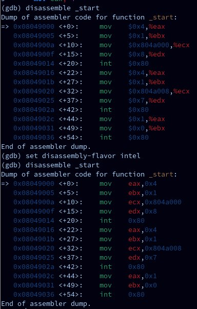{#fig:0011 width=70%}

В режиме ATT имена регистров начинаются с символа %, а имена операндов с $, в то время как в Intel используется уже привычный нам синтаксис.

Включаю режим псевдографики для более удобного анализа программы

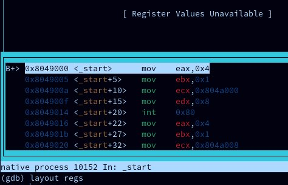{#fig:0012 width=70%}

## Добавление точек останова

Проверяю правильность установки точки останова по имени метки _start, устанавливаю ещё одну точку по адресу mov ebx,0x0 и просматриваю информацию о всех установленных точках останова

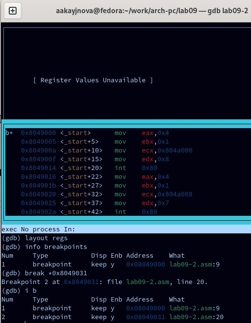{#fig:0013 width=70%}

## Работа с данными программы в GDB

Выполняю 5 инструкций с помощью команды stepi и слежу за изменением значений регистров

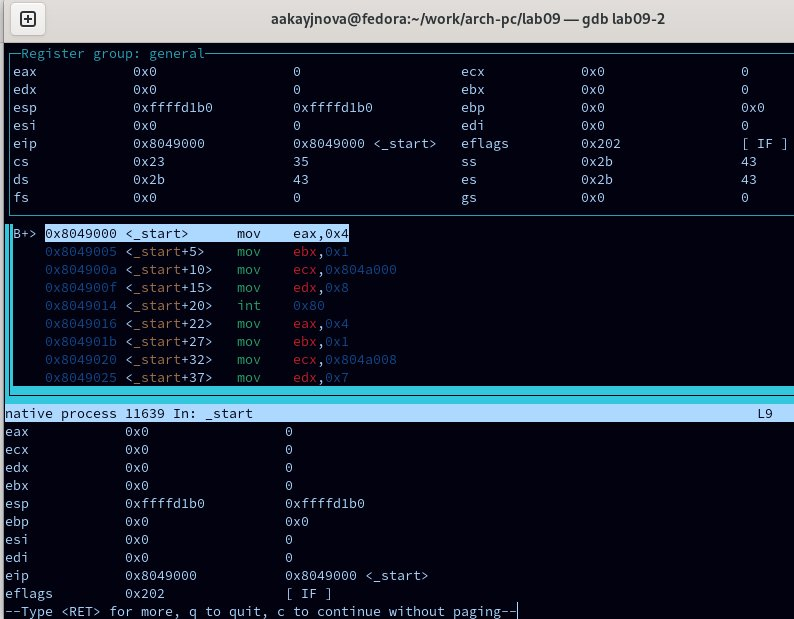{#fig:0014 width=70%}

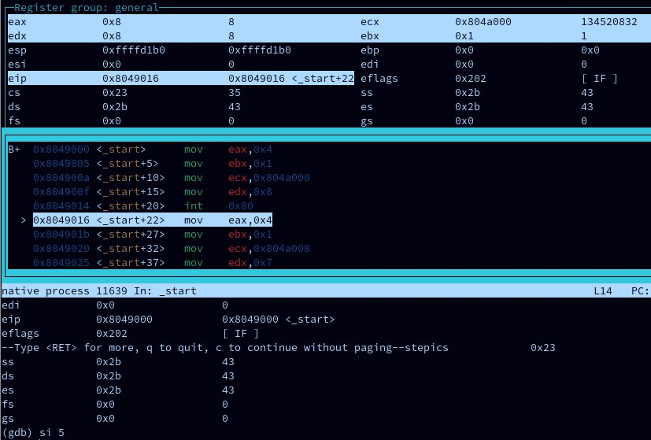{#fig:0015 width=70%}

Изменились значения регистров eax,ecx,edx,ebx.

Просматриваю значение переменной msg1 и msg2 по их адресам

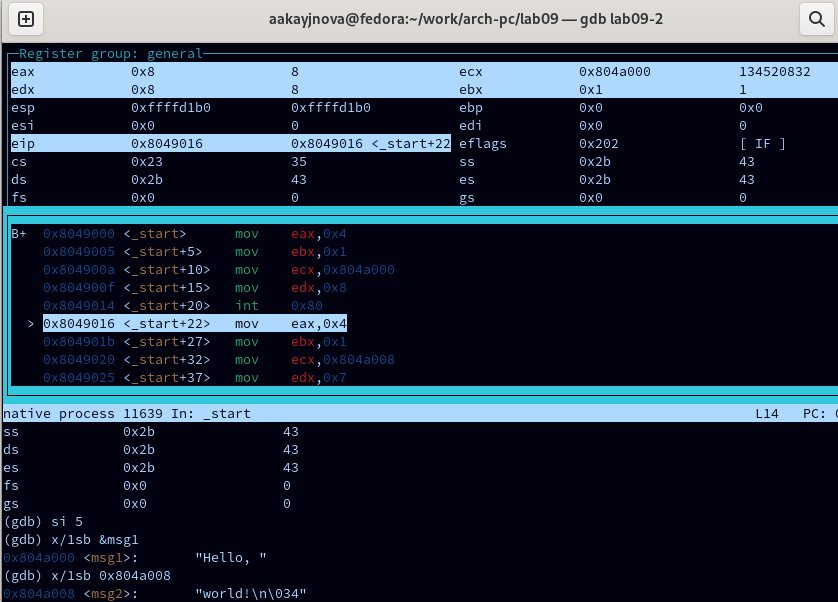{#fig:0016 width=70%}

Изменяю первый символ переменной msg1 и заменяю первый символ в переменной msg2

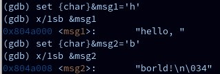{#fig:0017 width=70%}

Вывожу в 16-теричном формате, в 2-ичном формате и в символьном виде значение регистра edx

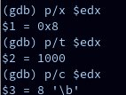{#fig:0018 width=70%}

Изменяю значение регистра ebx согласно заданию

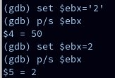{#fig:0019 width=70%}

Разница вывода команд в том, что в первом случае мы переводим символ в его строковый вид, а во втором случае число в строковом виде не изменяется.

Завершаю выполнение программы и выхожу из GDB

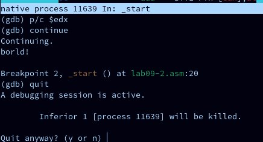{#fig:0020 width=70%}

## Обработка аргументов командной строки в GDB

Копирую файл lab8-2.asm в файл lab09-2.asm и создаю исполняемый файл

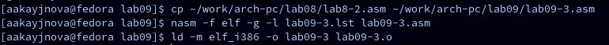{#fig:0021 width=70%}

Загружаю исполняемый файл в отладчик GDB, указав необходимые аргументы

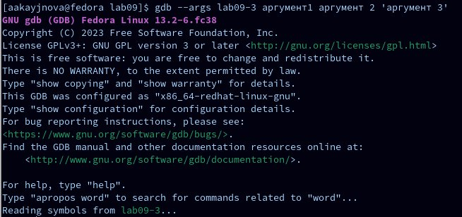{#fig:0022 width=70%}

Устанавливаю точку останова перед первой инструкцией в программе и запускаю её

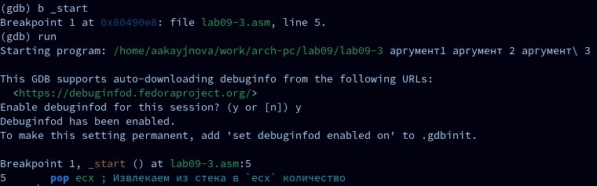{#fig:0023 width=70%}

Просматриавю вершину стека и позиции стека по адресам

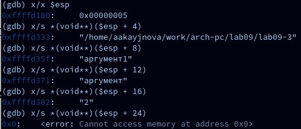{#fig:0024 width=70%}

Шаг изменения адреса равен 4, так как количество аргументов командной строки - 4.

## Выполнение заданий для самостоятельной работы 

Преобразовываю программу из лабораторной работы № 8 (задание № 1), реализовав вычисление значения функции f(x) как подпрограмму

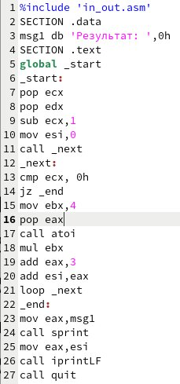{#fig:0025 width=70%}

Запускаю код и проверяю правильность его работы

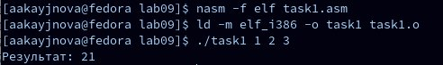{#fig:0026 width=70%}

Ввожу в файл task2.asm текст программы из листинга 9.3

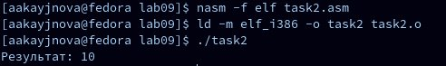{#fig:0027 width=70%}

Если программа работает верно, то на экран выведется "25".

Создаю исполняемый файл и проверяю его

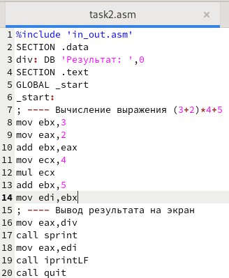{#fig:0028 width=70%}

Выводится неправильный ответ.

Получаю исполняемый файл для GDB, запускаю его и ставлю брейкпоинты на каждой инструкции, связанной с вычислениями. Прохожусь по каждому брейкпоинту и слежу за изменениями значений регистров.

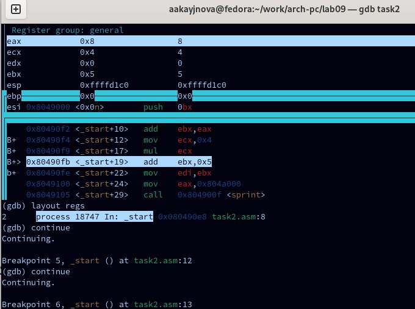{#fig:0029 width=70%}

Тут мы и получаем ошибку

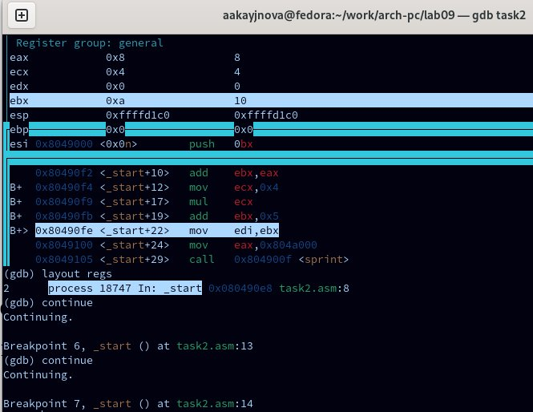{#fig:0030 width=70%}

Мы получаем неправильный ответ при выполнении инструкции mul ecx, во время которой ecx умножается на eax, то есть 4 умножается на 2, вместо правильного умножения на 5(то есть на регистр ebx). Причина в том, что инструкция dd ebx,eax (перед mov ecx,4) никак не связана с mul ecx, однако с mul ecx связана инструкция mov eax,2. 

Исправлю ошибку, добавив необходимые инструкции

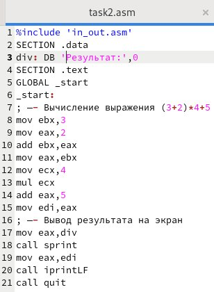{#fig:0031 width=70%}

Создаю исполняемый файл и проверяю его

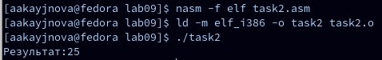{#fig:0032 width=70%}

Выводится правильный результат, значит ошибка исправлена.

# Выводы

В ходе данной лабораторной работы мы научились писать программы с использованием подпрограмм и ознакомились с методами отладки через GDB.

# Список литературы{.unnumbered}

1. https://esystem.rudn.ru/pluginfile.php/2089096/mod_resource/content/0/%D0%9B%D0%B0%D0%B1%D0%BE%D1%80%D0%B0%D1%82%D0%BE%D1%80%D0%BD%D0%B0%D1%8F%20%D1%80%D0%B0%D0%B1%D0%BE%D1%82%D0%B0%20%E2%84%969.%20%D0%9F%D0%BE%D0%BD%D1%8F%D1%82%D0%B8%D0%B5%20%D0%BF%D0%BE%D0%B4%D0%BF%D1%80%D0%BE%D0%B3%D1%80%D0%B0%D0%BC%D0%BC%D1%8B.%20%D0%9E%D1%82%D0%BB%D0%B0%D0%B4%D1%87%D0%B8%D0%BA%20..pdf
